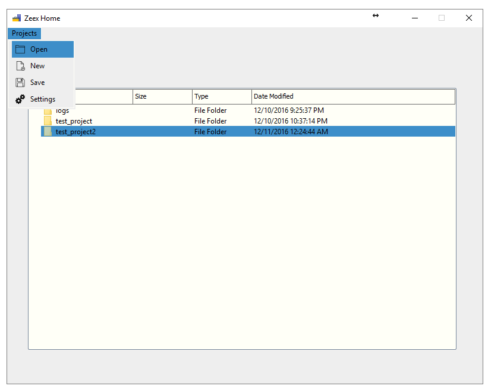
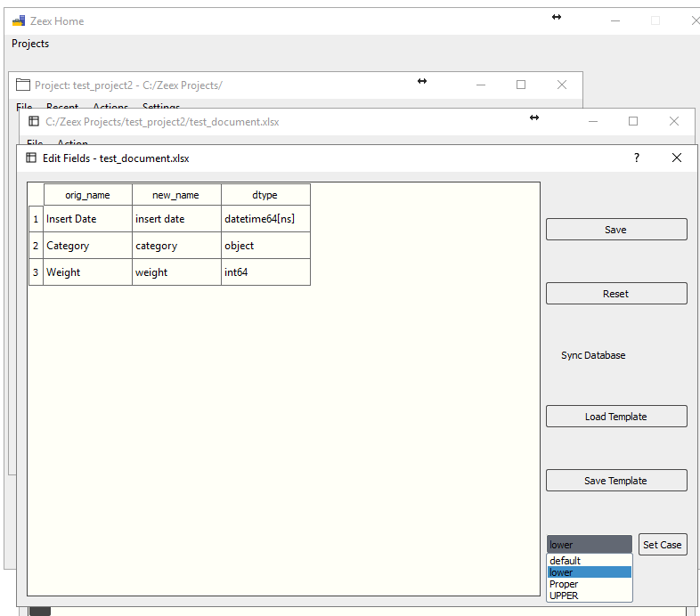
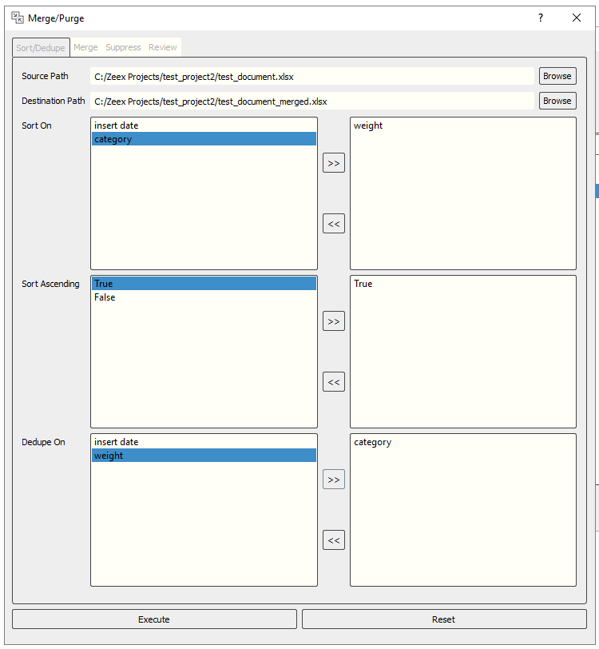

# zeex

A Python GUI studio for data analysis. Utilizes Qt/PySide and Pandas libraries to provide a flexible toolbox for reading, writing, and manipulating rows and columns.

# Features:
- A configuration template-maker for common tasks like
    - renaming headers
    - sorting
    - merging
    - purging
    - deduplicating.

- A file reader that guesses the encoding and delimiter of most file formats
    - .csv
    - .txt
    - .xlsx
    - .pickle

- Lightning fast read, process, and write speed.

# To-do:
- FTP I/O interface
- Pandas/Matplotlib Charts & Graphs
- SQLAlchemy I/O interface

# Screenshots:

- Home Window

- Project Window

- File Window

- Edit Fields Dialog

- Merge/Purge Dialog

