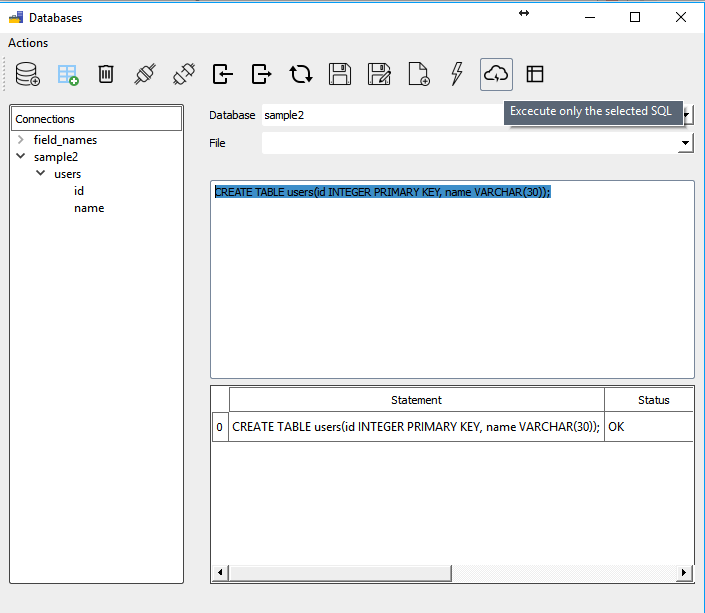

# zeex

A Python GUI studio with a goal to make common data analysis and standardization tasks simple.
Utilizes PySide, pandas, and SQLAlchemy libraries to provide a flexible toolbox for 
working with rows and columns in many formats.

# Features:
- A light-weight SQL view/query tool using SQLAlchemy:
	- Connect PostgreSQL, SQLite, & MySQL databases
	- Edit, execute, and save SQL queries.
	- Import files to tables
	- Export tables/queries to files

- A template-maker for common tasks like:
    - Renaming & organizing headers
    - Sorting rows
    - Merging/purging other data sets based on common fields
    - Removing duplicate records
    - Splitting to multiple files
    - Text-to-columns
    - Concatenate columns

- Easy data-normalizations
    - Drop/fill missing values
    - Merge or split columns
    - Set case (upper/lower/proper)
    - Parse dates into YYYY-MM-DD format
    - Remove special characters/trim extra spaces

- File analyzer displaying a summary of your data instantly:
    - Minimum/Maximum, Sum, & Median values (of number & date columns)
    - Count of non-NA records (on string columns)

- Manage project files & folders in-app:
    - Renaming
    - Compression
    - DropBox upload/download

- A file reader that guesses the encoding and delimiter of most file formats
    - .csv
    - .txt
    - .xlsx
    - .pickle

- Lightning fast read, process, and write speed.
    - 250MB CSV open time: 7sec (v.s. Excel: 74sec)

- Issues are managed on Github using ZenHub - see upcoming features and feel free to contribute feedback, suggestions, or code.

# Screenshots:

- Home Window

- Database Main Window

- Project Window

- File Window

- Edit Fields Dialog

- Merge/Purge Dialog

